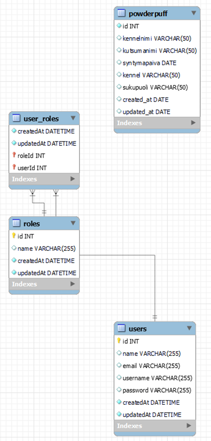

# REST-API CRUD with Authorization and Authentication, MYSQL Database example

http://localhost:8080/koirat_api  
http://localhost:8080/api/auth/... login and registry 
http://localhost:8080/api/test/... IDP

## HTTP-methods 
+ Add new dog
+ Show all dogs
+ Show dog by ID
+ Delete dog by ID
+ Upadate dog by ID

## Authorization and Authentication
+ New user registry
+ Login
+ JWT (Json Web Token)
+ IDP (User, PM, ADMIN)
+ Show all registered users

## Specs
* Database: MySQL
* Language: JavaScript
* Server/runtime environment: NodeJS

1. Picture. Database with four table.

Date: 6/2023
> Nina Päivinen
