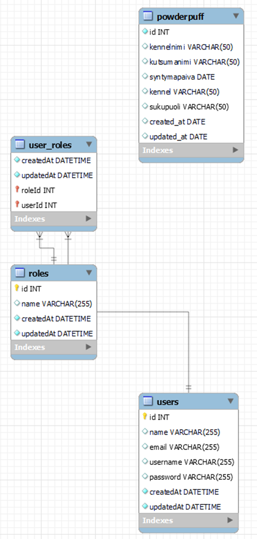

# Opinnäytetyö: REST-API:n toteutus sisältäen valtuuttamisen ja todentamisen

REST API CRUD -projekti, joka toteuttaa koirien tietojen hallinnan sekä käyttäjien autentikoinnin ja auktorisoinnin.

Projektin alkuperäinen toteutus liittyy opinnäytetyöhöni:

https://www.theseus.fi/items/d430863e-cc3e-4ab8-9d4b-49fff3924421

EI TEKOÄLYÄ KÄYTETTY tuolloin.

## HTTP Methods

API sisältää CRUD-toiminnot koirien hallintaan:

* Add new dog
* Show all dogs
* Show dog by ID
* Update dog by ID
* Delete dog by ID

## Authentication & Authorization

Käyttäjähallinta sisältää:

* User registration
* Login
* JWT (JSON Web Token)
* IDP / käyttäjäroolit

  * User
  * PM
  * ADMIN
* Registered users listing

## API Endpoints

### Dogs

```text
http://localhost:8080/koirat_api
```

### Authentication

```text
http://localhost:8080/api/auth/
```

Sisältää esimerkiksi rekisteröinnin ja kirjautumisen.

### Authorization / IDP

```text
http://localhost:8080/api/test/
```

IDP:n ja käyttäjäroolien testaamiseen.

## Technologies

* **Language:** JavaScript
* **Runtime:** Node.js
* **Database:** MySQL
* **Authentication:** JWT
* **Authorization:** Role-based access / IDP

## Database

Projektissa käytetään MySQL-tietokantaa, joka koostuu neljästä taulusta.



*Database structure – four tables*

## Project Information

**Date:** 06/2023

**Author:** Nina Päivinen

## Status

Projekti on opinnäytetyön yhteydessä toteutettu REST API -projekti ja toimii esimerkkinä CRUD-toiminnoista, JWT-autentikoinnista sekä käyttäjärooleihin perustuvasta auktorisoinnista.

Projekti on aikansa 2023 oppimisprojekti. Se ei ole tarkoitettu tuotantokäyttöön, eikä sen autentikointi- tai auktorisointiratkaisuja tule käyttää sellaisenaan uusissa tuotantojärjestelmissä.

Web-kehityksen käytännöt, tietoturvaratkaisut ja työkalut ovat kehittyneet merkittävästi projektin toteutuksen jälkeen. Projekti säilytetään ennen kaikkea osana omaa kehityshistoriaani ja esimerkkinä siitä, mistä full-stack-kehityksen opiskelu ja käytännön toteutukset lähtivät liikkeelle.